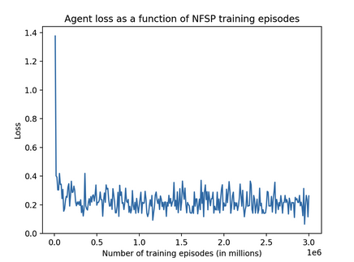

## Video
[Link](https://youtu.be/arcjUgzfG74)

## Project Summary


For the past 10 weeks, team All in N Ballin has been focusing on creating an AI agent to optimally play the popular card game poker, more specifically no-limit, heads-up (2-player) Texas Hold ‘Em variant.

For those who may be unfamiliar with the poker variant, Texas Hold ‘Em begins with each player placing their respective blind bets, then the distribution of two cards that can only be seen by the player holding them. Over the next four betting rounds, players decide whether to fold, call, or raise, choosing the action they believe is optimal to preserving or winning chips. The winner of the game is the player that either doesn’t fold, or in the case neither player folds, the player with the best poker hand. For more details on the rules please refer [here](https://bicyclecards.com/how-to-play/texas-holdem-poker). Additionally, please note our implementation of poker excludes the bluffing component of poker.

This poker variant’s state space is incredibly large and is composed of game round, board cards, hole cards, player turns/ blinds, players’ chip counts, player actions, and bet sizes. With the shuffled deck of cards alone, the state space is already fifty-two factorial in size.  However, the true absurdity of no-limit Hold ‘Em’s complexity is not just in the size of its state space, but in the vastness of its action space. Because players can bet any amount larger than the minimum bet and less than their stack (chip count), the game features a continuous action space. Additionally, Hold ‘Em is an imperfect information game, meaning there are hidden variables such as opponent cards, that complicate decision making. This results in a massive branching factor within the game tree, significantly increasing the difficulty of finding the optimal strategy, and necessitating the use of a more sophisticated problem-solving approach, such as machine learning.

Our team experimented with several algorithms of varying complexity to tackle the Hold'em problem before landing on the Neural-Fictitious Self-Play (NFSP) reinforcement learning algorithm, a hybrid imitation-reinforcement learning approach. Our initial goal was to approximate the Nash equilibrium as closely as possible, thereby achieving optimal play. To quantitatively assess the performance of our agent, we have reviewed our approximate exploitability and loss. For qualitative evaluation, we are integrating the agent with a graphical user interface (GUI) that allows us to directly play against it and gauge how well it performs in “live” gameplay.

## Approaches

Throughout our project we experimented with three major different models to try and solve the optimal playing strategy for Hold ‘Em. These models were imitation CNN, counterfactual regret minimization (CFR), and neuro-fictitious self play (NFSP). 

We experimented with an imitation model utilizing convolutional neural networks that was trained on data from the Annual Computer Poker Competition. Despite imitation’s relatively simple implementation and concept, we found that there were several challenges. The biggest of which was that the training dataset provided by ACPC doesn’t perfectly match the poker variant from our problem statement, which meant that we would have had to create our own data to provide to our model. Creating a dataset large enough to properly train the model would’ve taken 10 weeks itself, thus we decided to abandon this learning model in favor of something requiring less training data. Additionally, the model’s exploitability is quite high as it doesn’t account for scenarios that aren’t present within the provided data.

After some research, we found that the world’s best poker bots used an algorithm called  Counterfactual Regret Minimization (CFR), and decided to give it a try. CFR models work by computing the “regret”, or how much gain a player gets if they had chosen a different action, and adjust the probability of choosing an action so as to minimize the regret. The way these models compute regret is by traversing down the action branches it did not take to see how much better it could have done. Our findings indicated that this algorithm would be the optimal solution; given its nature, advantages include that it is highly accurate and performant, and it is used in many poker bots for that reason. However, the main disadvantage of this model is that it is incredibly computationally complex. Because no-limit has a significantly higher branching factor, CFR has to do significantly more work to calculate regret per decision node. Training for poker games with limits was already difficult, but training for no-limit was simply impossible in any reasonable amount of time due to its large action space; we ran the algorithm for over twelve hours but could not make it past ten thousand training steps. Thus, another model more complex than imitation, but less complex than CFR had to be considered.


*Figure 0: CFR Pseudocode*

The algorithm we finally settled on using is Neural-Fictitious Self-Play (NFSP), described as “a deep reinforcement learning method for learning approximate Nash equilibria of imperfect-information games” (Heinrich and Silver 2020). NFSP is a hybrid between reinforcement learning and supervised imitation learning. The NFSP agents utilize reinforcement learning to train a neural network from game experiences against fellow agents to predict future moves, while also training another neural network off of its own moves against fellow agents utilizing supervised learning. From these two neural networks, agents “ cautiously [sample] its actions from a mixture of its average, routine strategy and its greedy strategy that maximizes its predicted expected value” (Heinrich and Silver 2020). NFSP is designed to optimize/minimize exploitability, for more information please refer to the Evaluation section on this page.


*Figure 1: NFSP Pseudocode*

The implementation of our agent relies on a custom Texas Hold ‘Em gamemode created with OpenSpiel’s universal_poker game to match the poker from our problem description. The specifics of our gamemode can be seen below:

```
CUSTOM_NO_LIMIT_HEADS_UP_TEXAS_HOLDEM_GAMEDEF = """\
GAMEDEF
nolimit
numPlayers = 2
numRounds = 4
raiseSize = 20 20 20 20
blind = 10 20
firstPlayer = 1
numSuits = 4
numRanks = 13
numHoleCards = 2
numBoardCards = 0 3 1 1
stack = 2000
END GAMEDEF
"""
```
*Figure 2: Texas Hold 'Em Gamemode OpenSpiel Parameters*

From there, we utilized the example NFSP implementation from OpenSpiel’s source code to run on our Texas Hold ‘Em game. The inputs of our approach are the state of the game, including: each agent’s hole cards, the state of the board cards, the players’ turns to be dealer, the pool chip count, and their chip count. From the inputs, the agent determines the legal actions, and returns one of four valid moves, call, raise, fold, or check. 

```
class NFSPPolicies(policy.Policy):
  """Joint policy to be evaluated."""

  def __init__(self, env, nfsp_policies, mode):
    game = universal_poker.load_universal_poker_from_acpc_gamedef(
        CUSTOM_NO_LIMIT_HEADS_UP_TEXAS_HOLDEM_GAMEDEF
    )
    player_ids = [0, 1]
    super(NFSPPolicies, self).__init__(game, player_ids)
    self._policies = nfsp_policies
    self._mode = mode
    self._obs = {"info_state": [None, None], "legal_actions": [None, None]}

  def action_probabilities(self, state, player_id=None):
    cur_player = state.current_player()
    legal_actions = state.legal_actions(cur_player)

    self._obs["current_player"] = cur_player
    self._obs["info_state"][cur_player] = (
        state.information_state_tensor(cur_player))
    self._obs["legal_actions"][cur_player] = legal_actions

    info_state = rl_environment.TimeStep(
        observations=self._obs, rewards=None, discounts=None, step_type=None)

    with self._policies[cur_player].temp_mode_as(self._mode):
      p = self._policies[cur_player].step(info_state, is_evaluation=True).probs
    prob_dict = {action: p[action] for action in legal_actions}
    return prob_dict
```
*Figure 3: NFSP Implementation*


Our NFSP implementation ran for three-million training steps, utilizing 128 neurons within the Q-net, and utilized these hyperparameters within the NFSP algorithm in OpenSpiel. The hyperparameters are as follows:
- reinforcement learning rate: .01
- supervised learning rate: .01
- policy update every n steps: 64 

## Evaluation

Our team evaluated the agent both quantitatively and qualitatively. The first quantitative measure of our agent’s performance is the approximate exploitability, which is a measure of how “well a strategy profile approximates a Nash equilibrium” with “the closer it [being] to zero, the closer the policy is to optimal” (Timbers et. al, 2022). The main quantitative metric we are evaluating our agent by is exploitability, To measure our exploitability, we called OpenSpiel’s ​​open_spiel.python.algorithms.exploitability.exploitability() function with our game tree along our policy class instances as parameters every ten–thousand training steps. This function would then return and log the exploitability. As seen in Figure 4, our agent’s exploitability continually reduced throughout the training steps, fluctuating between .01 and .02 towards the end, and marking ~ .015 exploitability on the final step. However, there is one caveat, OpenSpiel has to traverse the entire game tree to find the exploitability, so just like CFR, it becomes impossible with large starting chip counts, thus Figure 4 is the exploitability with a starting stack of 10 and min bet of 1, thus our exploitability on higher stacks may be higher.


*Figure 4: Exploitability as a function of training steps*


Another quantitative metric we tracked was the loss for the NFSP agent. When we discussed loss in our progress report a few weeks ago it was fluctuating wildly, but through some hyperparameter tuning and bug fixing it seems we were able to stabilize the loss. Loss began extremely high but lowered to around 0.2 after about 0.25 million training episodes, then oscillated between about 0.1 and 0.3. Since our progress report, we were able to stabilize the wild fluctuations in loss that our agent experienced. We theorize this is due to a change in the way we trained our model; previously, we had two different agents playing against each other, with one agent always going first. This was altered to have the agents take turns of who goes first so that the agent isn’t trained with only going first or only going second, and thus the agent generalizes better. The loss for our agent was retrieved by using open_spiel’s NFSP agent as a base for our implementation, and calling the already implemented `.loss` method.


*Figure 5: Loss as a function of training steps*


Our biggest shortcoming in evaluation was the lack of qualitative assessment methods. In the final phase of our project, we attempted to implement a GUI that would allow real-time gameplay against our agent, enabling us to gauge its performance against players of varying skill levels. However, we were unable to accomplish this. Initially, we tried using the ACPC GUI client, which supports "plug and play" integration with our agent and poker instance. However, since we trained and stored our bot in the HPC3 environment, we lacked the necessary permissions to install required software like Ruby-Bundle, which the ACPC GUI client depended on. Upon realizing this, we attempted to adapt SirRender00’s Poker GUI to work with ACPC’s protocol. Unfortunately, the implementation of this GUI was significantly different from ACPC’s protocol, making it infeasible to adapt within our remaining time. Had we known the ACPC GUI wouldn’t work, we would have prioritized the GUI more.


*Figure 6: ACPC GUI Screenshot*


## References

###### Code Documentation:
- [https://openspiel.readthedocs.io/en/latest/index.html](https://openspiel.readthedocs.io/en/latest/index.html)
- [https://matplotlib.org/](https://matplotlib.org/ )
- [https://texasholdem.readthedocs.io/en/stable/guis.html#abstract-gui](https://texasholdem.readthedocs.io/en/stable/guis.html#abstract-gui)
- [https://rubydoc.info/github/dmorrill10/acpc_poker_gui_client/master/frames](https://rubydoc.info/github/dmorrill10/acpc_poker_gui_client/master/frames)

###### OpenSpiel Source Code:
- [https://github.com/google-deepmind/open_spiel/blob/master/open_spiel/python/examples/universal_poker_cfr_cpp_load_from_acpc_gamedef_example.py](https://github.com/google-deepmind/open_spiel/blob/master/open_spiel/python/examples/universal_poker_cfr_cpp_load_from_acpc_gamedef_example.py)
- [https://github.com/google-deepmind/open_spiel/blob/master/open_spiel/python/examples/kuhn_nfsp.py](https://github.com/google-deepmind/open_spiel/blob/master/open_spiel/python/examples/kuhn_nfsp.py)

###### OpenSpiel Algorithms:
- [https://github.com/google-deepmind/open_spiel/blob/master/open_spiel/python/algorithms/nfsp.py](https://github.com/google-deepmind/open_spiel/blob/master/open_spiel/python/algorithms/nfsp.py)
- [https://github.com/google-deepmind/open_spiel/blob/master/open_spiel/python/algorithms/exploitability.py](https://github.com/google-deepmind/open_spiel/blob/master/open_spiel/python/algorithms/exploitability.py) 

###### Scientific Reports:
- [https://www.davidsilver.uk/wp-content/uploads/2020/03/nfsp-1.pdf](https://www.davidsilver.uk/wp-content/uploads/2020/03/nfsp-1.pdf )
- [https://www.ijcai.org/proceedings/2022/0484.pdf](https://www.ijcai.org/proceedings/2022/0484.pdf)

###### ACPC Dataset (Imitation Learning):
- [http://www.computerpokercompetition.org/index.php/competitions/rules?id=80](http://www.computerpokercompetition.org/index.php/competitions/rules?id=80)

###### Libraries:
- OpenSpiel & dependencies (TensorFlow, NumPy, Pandas etc.)
- MatPlotLib
- PyTorch
- ABSL-Py
- [SirRender00’s Texas Hold Em](https://github.com/SirRender00/texasholdem)
- [ACPC Poker GUI Client](https://github.com/dmorrill10/acpc_poker_gui_client)

## AI Tool Usage

We only used AI minimally for broad conceptual questions about certain reinforcement-learning algorithms. Due to the nature of LLMs, AI tools were not of any technical use to our team throughout the project. Our project utilizes niche algorithms and libraries that AI is not sufficiently trained on, thus any help we received for our code came directly from class resources and library documentation.
