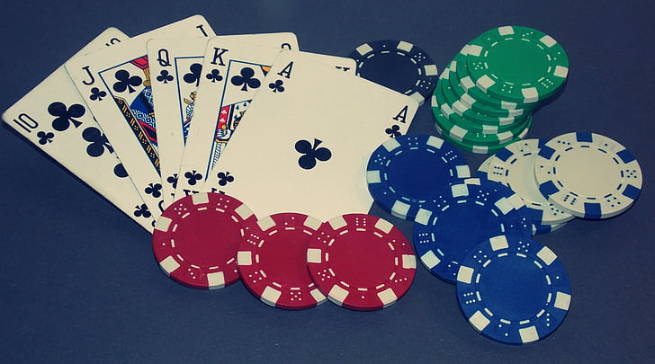

### Project Description

Project “All in N Ballin’” focuses on creating an AI agent to play no-limit, heads-up Texas Hold ‘Em Poker. We are relying on an existing Python library, Google’s OpenSpiel, to utilize its existing poker implementation, help us create our training environment, and utilize its existing implementations of reinforcement learning algorithms. The goal for our project is to create a poker agent that reduces exploitability, and therefore approximates the Nash Equilibrium as close as possible. We are mainly using the Neural-Fictitious Self-Play (NFSP) reinforced learning algorithm to reduce exploitability in our agent.

### Source code
https://github.com/HenryCuev/All-in-N-Ballin

### Reports:

- [Proposal](proposal.html)
- [Status](status.html)
- [Final](final.html)

### Relevant Reads
- https://thegradient.pub/libratus-poker/
- https://www.science.org/doi/10.1126/science.aao1733
- https://www.davidsilver.uk/wp-content/uploads/2020/03/nfsp-1.pdf
- https://www.ijcai.org/proceedings/2022/0484.pdf